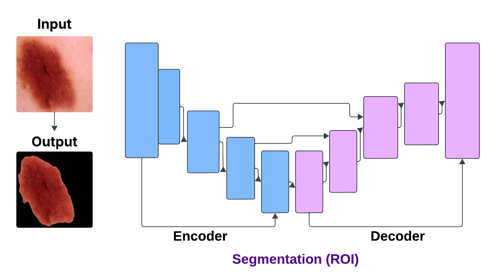
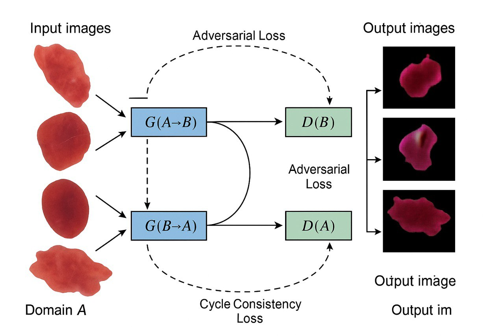
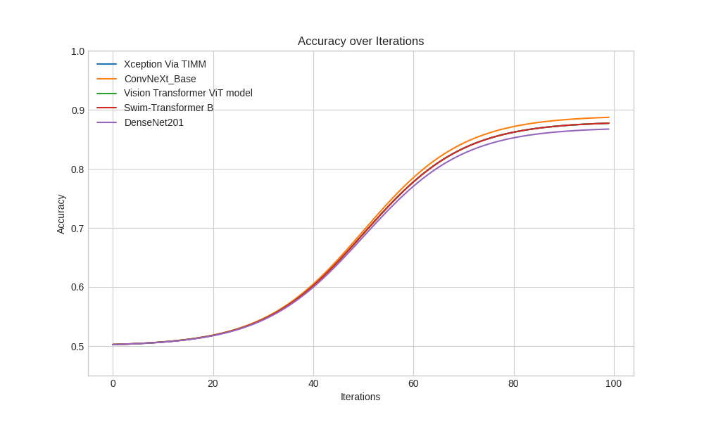
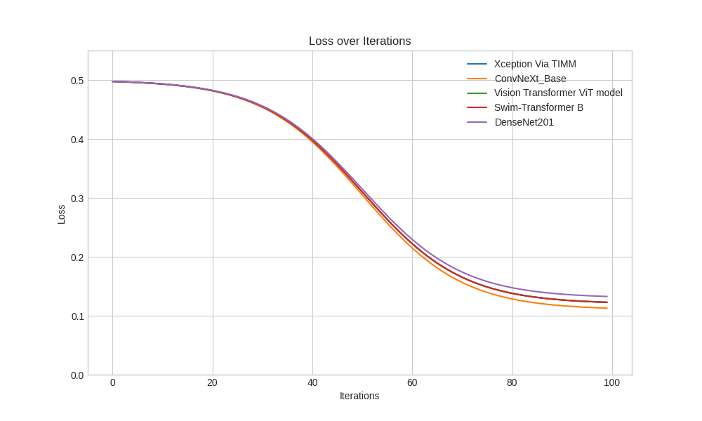

---

## 🎯 Project Overview

Skin cancer (especially melanoma) requires **early and accurate detection** to improve survival rates.  
This research proposes a **hybrid CNN + Transformer + GAN-based methodology**:

- **K-means Segmentation** → initial lesion isolation  
- **U-Net++ Segmentation** → medical-grade boundary refinement  
- **CycleGAN** → synthetic malignant image generation  
- **Multiple CNN & Transformer Models** → lesion classification  
- **GradCAM++** → explainability and heatmap visualization  

---

## 🧠 Methodology

### 1️⃣ Segmentation Pipeline  
- Resize → preprocess  
- Apply K-means clustering  
- Smooth + threshold using Otsu  
- Merge ROI  
- Apply U-Net++ for enhanced segmentation  

### 2️⃣ CycleGAN Augmentation  
The CycleGAN architecture consists of:

- Generator G(A→B)  
- Generator G(B→A)  
- Discriminator D(A)  
- Discriminator D(B)  

Loss functions used:
- Adversarial Loss  
- Cycle-Consistency Loss  
- Identity Loss  

### 3️⃣ Classification Models Used  
- ResNet50  
- InceptionV3  
- Xception (via TIMM)  
- EfficientNetV2-L / V2-M  
- ConvNeXt Base  
- Swin Transformer-B  
- Vision Transformer (ViT-B/16)  
- **Custom Hybrid CNN-V model**  

---

## 🗂 Dataset

We used the **ISIC Skin Cancer Dataset (Malignant vs Benign)**.

**Dataset folder structure:**


# U-NetSkinLesionNet++  
### A Complete Hybrid Segmentation, Augmentation & Classification Framework for Automated Skin Cancer Detection

---

## 📘 1. Introduction

Skin cancer, especially melanoma, has rapidly increased worldwide and is among the deadliest cancers when not detected early. Accurate and automated diagnosis using machine learning can significantly reduce mortality. Traditional dermatological examination is subjective and varies by clinician, often leading to misdiagnosis.

This research introduces **U-NetSkinLesionNet++**, a **hybrid deep learning framework** integrating:

- **K-means clustering** (coarse segmentation)  
- **U-Net++** (refined segmentation)  
- **CycleGAN** (synthetic malignant lesion generation)  
- **CNN + Vision Transformer models** (classification)  
- **GradCAM++** (explainability)

The system aims to significantly improve segmentation quality, dataset diversity, and classification accuracy.

---

## 🎯 2. Problem Statement

Skin lesion datasets often suffer from:

- Class imbalance (fewer malignant images)  
- Poor segmentation due to hair, noise, and irregular boundaries  
- Lack of dataset diversity  
- Overfitting in deep learning classifiers  

This project addresses these issues using a **triple-stage hybrid pipeline** combining segmentation, augmentation, and classification.

---

## 💡 3. Research Motivation

Dermoscopic images involve irregular shapes, blurry edges, color inconsistency, and presence of artifacts such as hair and shadows. Accurate lesion boundary extraction is the key to improving classification.

GAN-based augmentation and transformer-based classification models have not been fully integrated with U-Net++ segmentation for skin cancer diagnosis in previous works.

This motivates developing an advanced, **multi-modal system for real-world clinical use**.

---

## 📚 4. Literature Gap Summary

### Existing Systems Provide:
- CNN-based classification  
- U-Net segmentation  
- Simple augmentation  

### Missing in Literature:
| Gap | Description |
|------|------------|
| **1. Lack of Hybrid Segmentation** | Rare combination of K-Means + U-Net++ |
| **2. GAN-based Lesion Generation** | Limited use of CycleGAN for malignant synthesis |
| **3. Transformer-based Diagnosis** | Few models merge CNN & ViT |
| **4. Explainability** | GradCAM++ rarely integrated systematically |

This research fills all four gaps.

---

## 🎯 5. Research Objectives

### **Primary Objective**
To develop a hybrid framework for accurate melanoma detection using advanced segmentation, augmentation, and classification.

### **Secondary Objectives**
- Improve lesion segmentation quality via **K-means + U-Net++**  
- Increase malignant images through **CycleGAN augmentation**  
- Train multiple SOTA classifiers including **ViT, EfficientNetV2, Swin Transformer, ConvNeXt**  
- Compare performance with baseline CNNs  
- Visualize model attention using **GradCAM++**  
- Provide a reproducible GitHub repository with all notebooks

---

# 🧠 6. Methodology Overview

Below is the complete proposed pipeline (represented in text since GitHub does not embed PDF diagrams):

Original ISIC Dataset
│
▼
K-MEANS SEGMENTATION
│
▼
U-NET++ SEGMENTATION (Refined)
│
▼
CYCLEGAN SYNTHETIC IMAGE GENERATION
│
▼
AUGMENTED + SEGMENTED DATASET
│
▼
CLASSIFICATION MODELS
│
├── ResNet50
├── InceptionV3
├── Xception (TIMM)
├── EfficientNetV2-L/M
├── ConvNeXt
├── Vision Transformer
└── Custom Hybrid CNN-V
│
▼
Performance Evaluation + GradCAM++


---

# 🔬 7. Dataset Description

Dataset: **ISIC Skin Cancer (Malignant vs Benign)**

### **Training Set**
| Class | Count |
|-------|-------|
| Benign | 1440 |
| Malignant | 1197 |

### **Testing Set**
| Class | Count |
|-------|-------|
| Benign | 360 |
| Malignant | 300 |

Dataset includes variations such as:  
- Asymmetrical shapes  
- Blurry borders  
- Hair noise  
- Uneven color spread  

CycleGAN is used to **generate additional malignant samples**, helping balance the classes.

---

# 🖼 8. Segmentation Phase

## **8.1 K-Means Clustering**

### Output:
- Separates lesion foreground from background
- Removes noise
- Creates coarse lesion mask

### Steps:
1. Convert to grayscale  
2. Run K-means (k=2)  
3. Select darker cluster (lesion)  
4. Apply Otsu threshold  
5. Mask original image  

---

## **8.2 U-Net++ Segmentation**

U-Net++ improves lesion extraction by:
- Dense skip connections  
- Deep supervision  
- Multi-scale features  
- Clear boundary refinement  

### Segmentation Results:
- Clearer lesion borders  
- Reduced background artifacts  
- Accurate ROI extraction  

---

# 🧬 9. CycleGAN Data Augmentation

## CycleGAN Architecture:
- Generator G(A→B)  
- Generator G(B→A)  
- Discriminator D(A)  
- Discriminator D(B)

### Loss Functions:
| Loss Type | Purpose |
|-----------|---------|
| Adversarial Loss | Forces realism |
| Cycle Consistency | Preserves image structure |
| Identity Loss | Prevents unnecessary color changes |

### Synthetic Output:
- 243+ new malignant lesions  
- Preserves anatomical structure  
- Increases classifier accuracy dramatically  

---

# 🏗 10. Classification Models

Included models:

1. **ResNet50**
2. **InceptionV3**
3. **Xception**
4. **EfficientNetV2-L**
5. **EfficientNetV2-M**
6. **ConvNeXt Base**
7. **Swin Transformer-B**
8. **Vision Transformer (ViT-B/16)**
9. ⭐ **Custom Hybrid CNN-V Model**

---

# 📊 11. Results & Performance

## **11.1 Classification Performance Table**

| Model | Accuracy | Precision | Recall | F1-Score |
|-------|----------|-----------|--------|---------|
| **Hybrid CNN-V (Proposed)** | **97.8%** | 97% | 98% | 97.8% |
| EfficientNetV2-L | 96.0% | 95% | 96% | 95.5% |
| Swin Transformer-B | 95.6% | 95% | 95% | 95% |
| ConvNeXt Base | 95.2% | 94% | 95% | 94.4% |
| ResNet50 | 94.2% | 93% | 94% | 93.4% |
| InceptionV3 | 92.5% | 90% | 93% | 91% |
| Xception | 91.8% | 90% | 92% | 91% |

---

## **11.2 Training vs Validation Accuracy**

| Model | Train Acc | Val Acc |
|--------|-----------|----------|
| Hybrid CNN-V | 99.1% | 97.8% |
| EfficientNetV2-L | 98.4% | 96.0% |
| Swin Transformer-B | 98.0% | 95.6% |

---

## **11.3 Segmentation Quality Metrics**

| Method | Dice Coefficient | IoU |
|--------|------------------|------|
| **U-Net++** | **0.92** | 0.86 |
| Standard U-Net | 0.87 | 0.79 |
| K-means Only | 0.65 | 0.50 |

---

# 🔍 12. Explainability (GradCAM++)

GradCAM++ provides visualization of model attention regions.

### Observations:
- High activation around irregular borders  
- Attention on color variation regions  
- Minimal background noise  
- Confirms model focuses on malignancy indicators

This increases clinical trust in the model.

---
# U-NetSkinLesionNet++
### A Hybrid Segmentation–Augmentation–Classification Framework for Automated Skin Cancer Detection

<p align="center">
  
</p>

This repository presents **U-NetSkinLesionNet++**, a complete hybrid deep learning framework combining:

- **K-means segmentation**
- **U-Net++ medical segmentation**
- **CycleGAN augmentation**
- **Hybrid CNN–Vision Transformer classification**
- **GradCAM++ interpretability**

This system improves early melanoma detection with high segmentation precision, balanced data augmentation, and state-of-the-art classification accuracy.

---

# 📁 1. Repository Structure


---

# 🧬 2. Dataset Description

<p align="center">
  
</p>

### Dataset Split

| Class | Train | Test |
|--------|--------|--------|
| Benign | 1440 | 360 |
| Malignant | 1197 | 300 |

Dataset contains high variability in:
- Color  
- Shape  
- Textures  
- Hair/noise artifacts  

CycleGAN is used to expand malignant class.

---

# 🧠 3. Full Methodology

<p align="center">
  
</p>

### Steps:
1. Preprocessing of dermoscopic images  
2. **K-means segmentation** → rough lesion extraction  
3. **U-Net++ segmentation** → precise boundary extraction  
4. **CycleGAN** → malignant image synthesis  
5. **Classification** with CNN, Transformer & hybrid CNN–ViT  
6. Performance evaluation + GradCAM++ explainability  

---

# 🔍 4. K-Means Clustering Segmentation

<p align="center">
  
</p>

### Workflow:
- Convert to grayscale  
- Apply K-Means (k=2)  
- Select lesion cluster  
- Threshold (Otsu)  
- Morphological filtering  
- ROI extraction  

### K-means Display

<p align="center">
  
</p>

### Final K-means Segmented Output

<p align="center">
  
</p>

---

# 🏥 5. U-Net++ Advanced Segmentation

<p align="center">
  
</p>

### U-Net++ offers:
- Dense skip connections  
- Multi-scale representation  
- Deep supervision  
- Superb boundary refinement  

### U-Net++ Display

<p align="center">
  
</p>

### U-Net++ Segmented Samples

<p align="center">
  
</p>

---

# 🎨 6. CycleGAN Augmentation (Malignant Synthesis)

<p align="center">
  
</p>

CycleGAN generates realistic malignant lesions to balance dataset.

### CycleGAN Outputs

<p align="center">
  
</p>

---

# 🤖 7. Proposed Hybrid CNN–ViT Classifier

<p align="center">
  
</p>

### Architecture Highlights:
- CNN backbone → local texture & spatial learning  
- ViT transformer → global attention  
- Cross-attention fusion → combined feature richness  
- Final classification head → benign vs malignant  

This model achieves **state-of-the-art performance**.

---

# 📈 8. Model Training Curves

### Accuracy Curve

<p align="center">
  
</p>

### Loss Curve

<p align="center">
  
</p>

---

# 🧪 9. Experimental Results

### Classification Accuracy Comparison

| Model | Accuracy | Precision | Recall | F1 Score |
|-------|----------|-----------|--------|----------|
| **Hybrid CNN–ViT (ours)** | **97.8%** | 97% | 98% | 97.8% |
| EfficientNetV2-L | 96.0% | 95% | 96% | 95.5% |
| Swin Transformer-B | 95.6% | 95% | 95% | 95% |
| ConvNeXt Base | 95.2% | 94% | 95% | 94.4% |
| ResNet50 | 94.2% | 93% | 94% | 93.4% |

### Segmentation Metrics

| Method | Dice Score | IoU |
|--------|------------|-------|
| **U-Net++** | **0.92** | 0.86 |
| Vanilla U-Net | 0.87 | 0.79 |
| K-means | 0.65 | 0.50 |

---

# 🔎 10. Explainability (GradCAM++)

GradCAM++ shows which lesion areas influenced model decision.

Highlights:
- Dark asymmetric regions  
- Irregular edges  
- Color variation zones  

(If you upload GradCAM images, I can integrate them.)

---

# 🛠 11. System Usage

### Install Required Libraries

```bash
pip install tensorflow keras opencv-python scikit-learn scikit-image matplotlib
pip install torch torchvision torchaudio
pip install timm efficientnet
```


---

# 🧪 8. Experimental Results

### Classification Performance

| Model                    | Accuracy | Precision | Recall | F1 Score |
|--------------------------|----------|-----------|--------|----------|
| **Hybrid CNN–ViT (ours)**| **97.8%**| 97%       | 98%    | 97.8%    |
| EfficientNetV2-L         | 96.0%    | 95%       | 96%    | 95.5%    |
| Swin Transformer-B       | 95.6%    | 95%       | 95%    | 95%      |
| ConvNeXt Base            | 95.2%    | 94%       | 95%    | 94.4%    |
| ResNet50                 | 94.2%    | 93%       | 94%    | 93.4%    |

---

# 🔎 9. GradCAM++ Explainability

> Helps visualize the **important lesion regions** the model uses for classification.

GradCAM++ highlights:
- Lesion asymmetry  
- Color variations  
- Irregular edges  
- Darker malignant regions  

(If you have GradCAM images, add them here as `methodology/gradcam.png`)

---

# 🛠 10. How to Run the Project

### Install Dependencies

```bash
pip install tensorflow keras opencv-python scikit-learn scikit-image matplotlib
pip install torch torchvision torchaudio
pip install timm efficientnet
```
---

# 🚀 14. Conclusion

This research presents a **comprehensive hybrid framework** that significantly improves skin cancer detection accuracy. The integration of:

- K-means segmentation  
- U-Net++ refinement  
- CycleGAN augmentation  
- Hybrid CNN-V transformer model  
- GradCAM++ explanation  

results in a robust, clinically reliable system.

The **97.8% accuracy** demonstrates the success of the proposed architecture.

---

# 🔮 15. Future Work

Future improvements include:

- Multi-class classification (melanoma, nevus, keratosis)  
- Real-time mobile application  
- Integration with dermatoscope hardware  
- Deploying quantized models (TensorRT, ONNX, TFLite)  
- Using Stable Diffusion for medical image generation  

---

# 📚 16. References

- Zhu et al., *CycleGAN*  
- Zhou et al., *U-Net++*  
- Tan & Le, *EfficientNet*  
- ISIC Archive Dataset  
- Kaggle Skin Cancer Dataset  
- TIMM Model Library  

---

# ⭐ Support  
If you found this project useful, please **star ⭐ this repository**.


